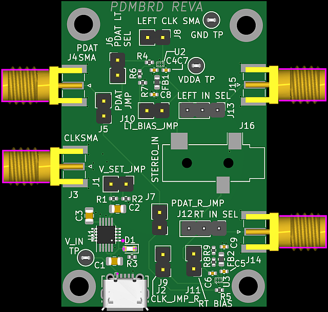

# PDMBRD 

## KiCAD 6.x board with two FAN3852 PDM analog to digital converters (ADCs).  

## Features

* Converts analog audio and ultrasound signals into digital Pulse Density (PDM) format
* Jumper selection for different options
* Accepts analog input signals from SMA connectors, jumper wire, or 3.5mm (1/8") stereo jack
* On-board low noise LT3042 voltage regulator (U1) powered from USB Micro provides 3.3V or 1.8V to the ADCs

* Board can be (mostly) assembled by JLCPCB (only U2 and UJ3 FAN3852 and J16 CUI SJ-3523-SMT audio jack need hand soldering)
* Much cheaper than OnSemi FAN3852 EVB 

## Equipment Required

* USB Micro cable for 5V power
* Analog source
* SMA and/or jumper wires to connect test equipment
* 3.5mm male stereo jack if using analog audio input
* PDMCLK source/PDMDAT Sink

## Operation

Set J1 to voltage of PDM input of the dut -- leave open for 3.3V and short for 1.8V operation.
Plug in J2 to a Micro USB jack to supply 5V to the board.
If the PDMCLK will be supplied via SMA, short jumpers J8/J9 for left and right channels respetively.  If feeding via jumper, insert female jumper wire to J8.1 and J9.1.
Short J6 and J7 to connect the left and right PDAT channels to J5.  If J5 will supply the PDAT output over SMA, short J5. If feeding via jumper, insert female jumper wire to J5.1.

### Audio in over 3.5mm jack
Set J12 and J13 to 2-3.
insert a 3.5mm male jack into J16.  The figure below shows 1.8V operation with the jumpers configured for audio in over J16, 3.5mm jack.

## Audio in over SMA
Set j12 and J13 to 2-1 and connect SMA cables to signal generator(s)

## Fabrication

The board was fabricated at JLCPCB.  The directory .\jlcpcb\gerbers contains the zip of the gerbers in the format that JLCPCB requires.  Follow the directions that JLCPCB have on their website for fabricating boards with KiCAD 6.  [link](https://jlcpcb.com/help/article/16-How-to-generate-Gerber-and-Drill-files-in-KiCad-6).  Note that .gtl is top layer, .gbl is bottom layer and .g2 and .g3 are the 2nd and 3rd layers respectively.  The JLCPCB BOM and XY files in .csv format are in .\jlcpcb\fabrication.  All devices were placed on the top layer for 'economic' JLCPCB assembly option.  The CUI SJ-3523-SMT audio jack and FAN3852UCX ADCs were not available for assembly at JLCPCB but are available from Mouser.  Note that FAN3852 is 0.4mm pitch.
 
## License

Licensed under the TAPR Open Hardware License (www.tapr.org/OHL)

See the PDMBRD REV A User Guide and schematic for more information
